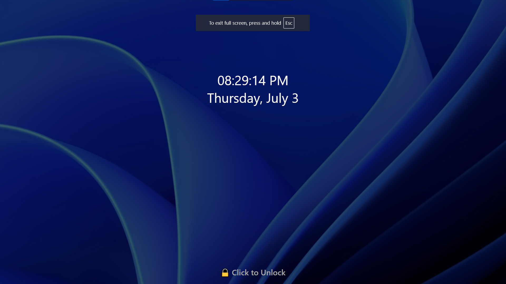
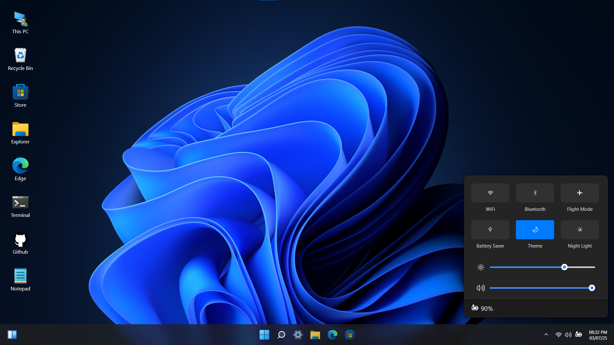
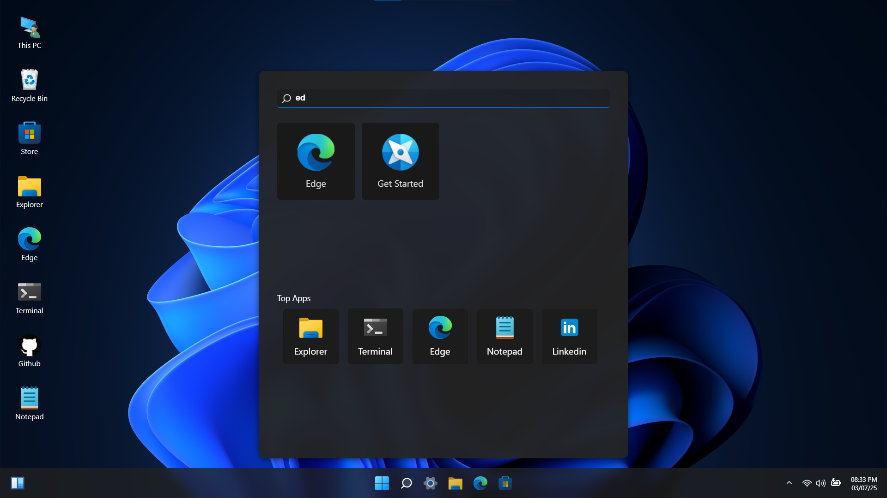
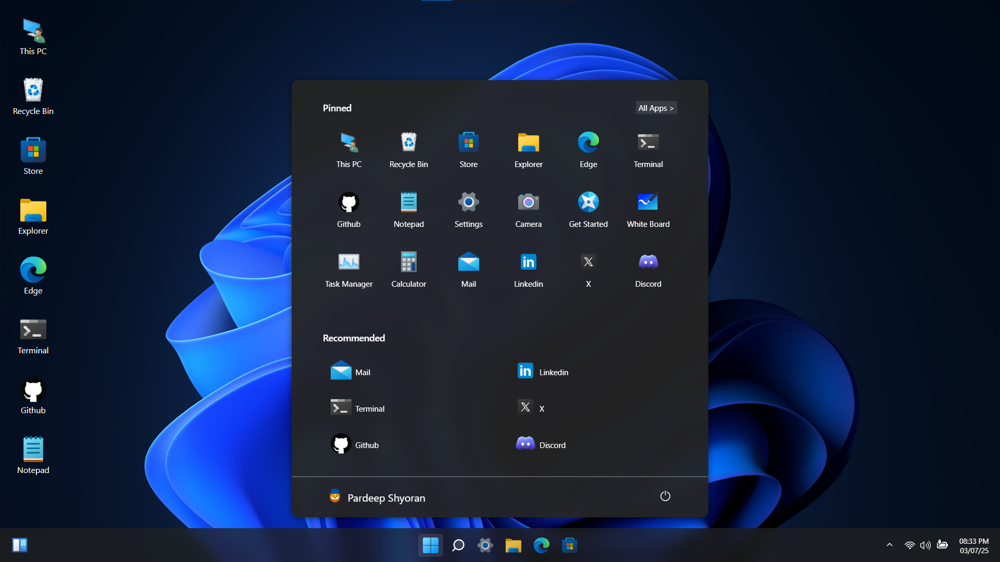
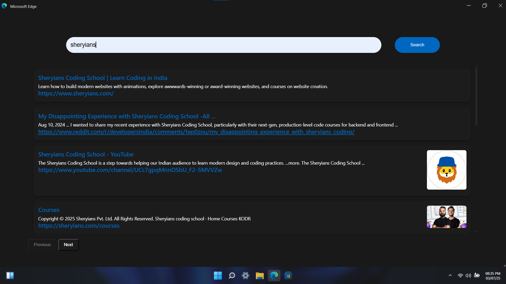
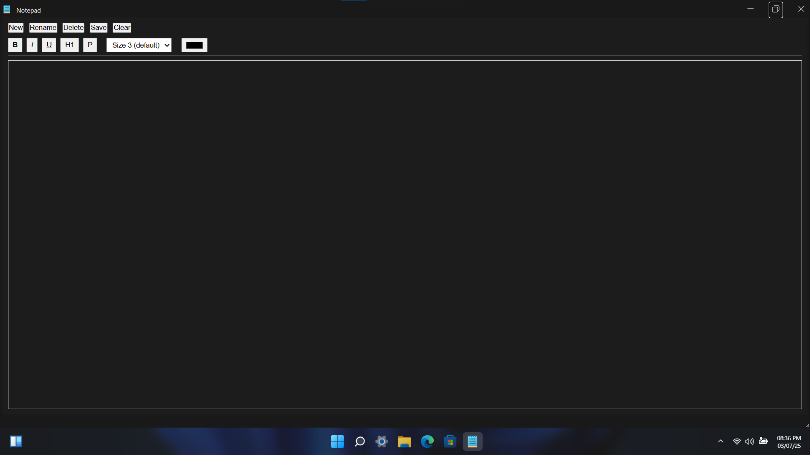
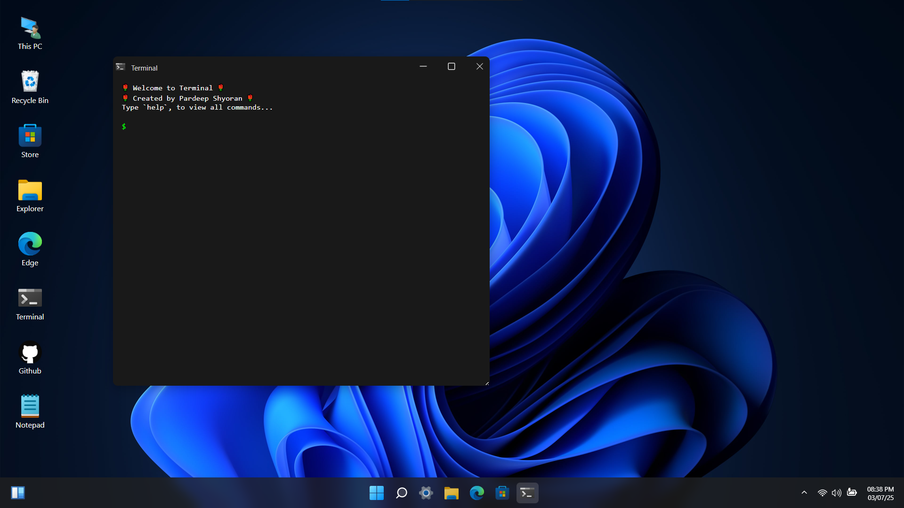
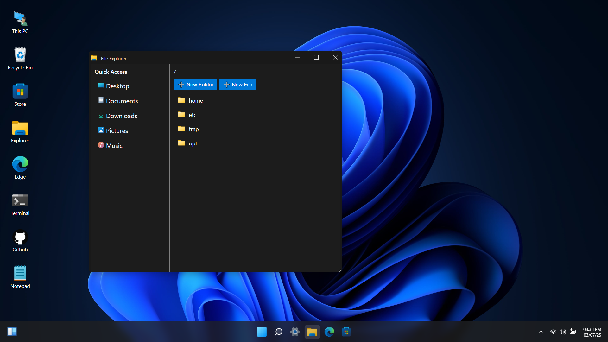

# 💻 Windows 11 Web-Based Experience

A fully functional, browser-based Windows 11 clone built using **HTML**, **CSS**, and **Vanilla JavaScript** – without any frameworks.  
This project is a front-end OS simulation with core desktop features like a taskbar, context menu, notepad, file explorer, and theming support.

> ⚡ Made as a passion project in just 15 days to explore and sharpen front-end development skills.

---

## 📸 Screenshot

> *[]*


---

## 🌟 Features

### ✅ Desktop Interface
- Create/Delete **Files & Folders** directly on the desktop
- Dynamic **Context Menu** (right-click support)
- Customizable **Wallpaper** and **Theme** options


## 📸 Screenshot

> *[]*

---

### ✅ **App Search**: 
- Search and open apps directly from the Search Menu.


## 📸 Screenshot

> *[]*

---

### ✅ Functional Taskbar
- Opened apps are shown in the **Taskbar**, just like real Windows
- Click to minimize, maximize, or focus apps


## 📸 Screenshot

> *[]*

---

### ✅ **Browser (In-App)**: 
- A basic working browser to open and display websites.

## 📸 Screenshot

> *[]*

---

### ✅ Notepad Application
- Create a **new file**, **save**, **rename**, and **clear** content
- Rich text formatting: **Bold**, *Italic*, **H1 Headings**
- **Font size** adjustment


## 📸 Screenshot

> *[]*

---

### ✅ Terminal
- Simple simulated terminal commands for demonstration


## 📸 Screenshot

> *[]*

---

### ✅ File Explorer
- Browse, create, and delete folders/files
- File-type icons and interactive UI


## 📸 Screenshot

> *[]*

---

## 🛠️ Tech Stack

- **HTML5**
- **CSS3**
- **Vanilla JavaScript** (no frameworks!)


## 🚀 Live Demo

🌐 [Live Link](https://os-windows-11.vercel.app/)

---

## 💻 GitHub Repository

📂 [GitHub Repo](https://github.com/Pardeep-Shyoran/Windows-11)

---

## 📚 What I Learned

- DOM manipulation and event handling in pure JS
- Simulating OS-level behavior in the browser
- Modular UI logic & state management without frameworks
- Designing interactive and user-friendly desktop interfaces

---

## 🤝 Contributions

Suggestions, feedback, or feature ideas are welcome!  
Feel free to fork, star ⭐, or raise an issue/pull request.

---

## Installation

1. Clone this repository to your local machine:
   ```bash
   git clone https://github.com/Pardeep-Shyoran/Windows-11.git

---

## 🙌 Acknowledgements

Inspired by the sleek interface of **Windows 11** and driven by curiosity to build it from scratch using core web technologies.

---
